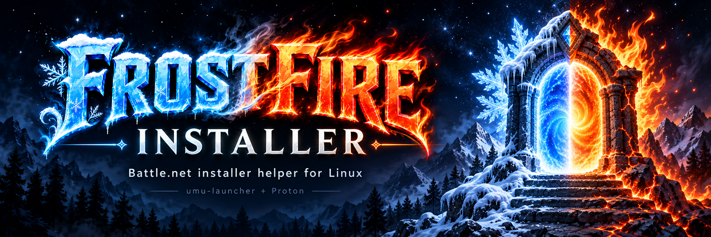
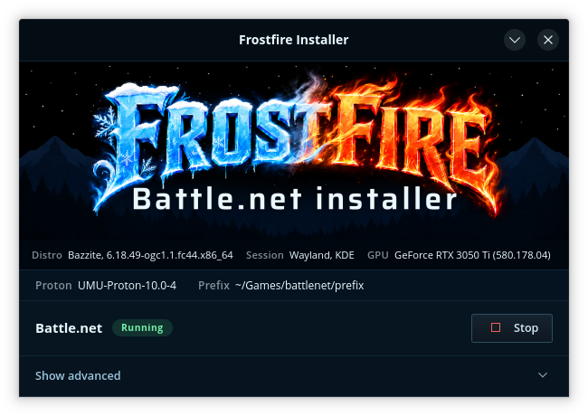
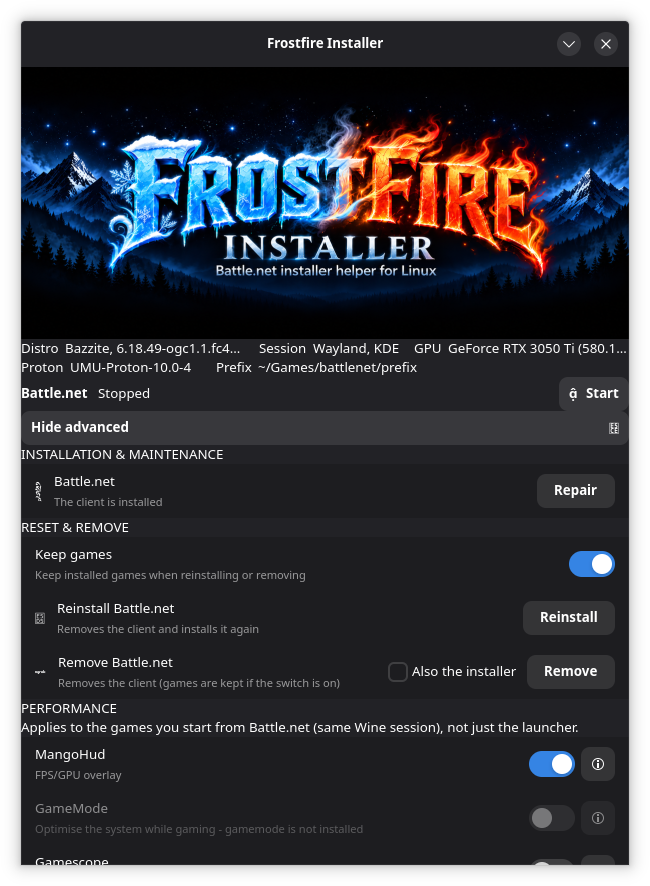

<p align="center">
  
</p>

# Frostfire Installer

> A **Battle.net installer helper** for Linux — stable and compatible, with a
> cool GUI. Backend: **umu-launcher + Proton**.

[](https://github.com/epatnor/frostfireinstaller/actions/workflows/ci.yml)
[](LICENSE)
[](pyproject.toml)

**Status:** v0.1 — first public release (a Python port of a verified prototype).
Early, but used daily on the reference machine. See [`docs/support.md`](docs/support.md)
for what is supported and what is out of scope.

---

## Focus

We are **not** building a game launcher or a game library. Games are started from
Blizzard's own Battle.net launcher — `frostfireinstaller` is the helper underneath:

- **Install, verify and repair Battle.net** reliably (dedicated prefix, idempotent).
- **Compatibility**: correct Proton runner and the required environment fixes.
- **Performance**: optional MangoHud, GameMode and Gamescope wrappers that follow the
  games (same Wine session), plus Proton's DXVK/VKD3D/NTSync.
- **Broad distro support** (Bazzite/Fedora atomic, Arch, Debian/Ubuntu, ...).
- **Looks cool:** a Battle.net-inspired GTK4/libadwaita UI with our own frost/fire
  palette — dark flat panels, uppercase section labels and gradient buttons. The
  window is a compact, fixed 608 px wide; everything except the run controls sits
  behind a "Visa avancerat" footer expander.

Born from a working recipe on Bazzite: `umu-launcher` + GE-Proton (see `docs/`).

---

## GUI

```bash
frostfireinstaller gui
```

- **Banner** (fixed height) → **info strip** (distro + kernel, session, GPU) →
  **config band** (Proton and prefix) → **Battle.net band**.
- **Battle.net band**: status pill and the action button (*Install* / *Start* /
  *Stop*). The start button runs `ensure()` first, so a missing client is installed.
- **Activity strip**: spinner + text showing the operation in progress.
- **System check & recommendations**: the app checks `umu-run`, Proton, **Vulkan**
  (version, software-only, 32-bit loader), free disk space, the prefix filesystem,
  hybrid GPU, the NVIDIA driver/module and recent `NVRM: Xid`/`NV_ERR_NO_MEMORY`,
  missing performance tools and the runner. A
  **warning strip** (below the band) appears only on problems and opens a dialog
  with **copy-ready commands**; the full report (including OK) is under
  **Advanced → Diagnostics → System check** and in `doctor`. The **reversible**
  action (GPU persistence) can be toggled in the app — the app never makes large
  system changes itself.
- **"Show advanced"** (footer with a chevron) expands everything else:
  - **Installation & maintenance** (ice): status + *Repair* in the same row.
  - **Reset & remove** (fire): *Keep games*, *Reinstall*, *Remove* (with the
    **Also the installer** checkbox).
  - **Performance** (with a "?" explanation per toggle), **Runner**, **Paths**
    (incl. *Open folder* and **View logs**) and **About**.

The window is **608 px wide and not resizable**; when expanded it only grows
downwards.

### Screenshots

| Main window | Advanced |
|---|---|
|  |  |

---

## Requirements

- Linux, Python **3.11+**
- [`umu-launcher`](https://github.com/Open-Wine-Components/umu-launcher) (`umu-run`)
- A Proton build (GE-Proton, UMU-Proton or Proton-CachyOS) in a `compatibilitytools.d`
  dir — or let `umu-launcher` download **UMU-Proton** automatically on first launch
- GPU drivers with **Vulkan 1.3+** (and a 32-bit Vulkan loader; Battle.net is 32-bit)
- Optional GUI extras: `python3-gobject` (GTK4 + libadwaita); MangoHud / GameMode /
  Gamescope if you want the performance toggles

## Install

Any distro with **Python 3.11+** works via `pipx`; there are also native
channels. Full matrix in [`docs/install.md`](docs/install.md).

| Channel | Command | For |
|---|---|---|
| pipx (universal) | `pipx install frostfireinstaller` | any distro |
| curl \| bash | `curl -fsSL .../packaging/install.sh \| bash` | any distro |
| AUR | `yay -S frostfireinstaller` | Arch, CachyOS, EndeavourOS, Manjaro |
| Bazzite / ublue | `ujust install-frostfireinstaller` | Fedora atomic images |
| Homebrew | `brew install epatnor/frostfireinstaller/frostfireinstaller` | Linux & macOS |
| Flatpak | *(experimental, Flathub pending)* | immutable desktops |

Not published yet — until the first release, install from a clone:

```bash
git clone https://github.com/epatnor/frostfireinstaller
cd frostfireinstaller
pipx install .                           # or: pip install --user .
```

## Usage

```bash
frostfireinstaller              # ensure + launch Battle.net
frostfireinstaller gui          # graphical interface
frostfireinstaller ensure       # set up/verify only
frostfireinstaller doctor       # show environment and status
frostfireinstaller reinstall    # reinstall the client (keeps games)
frostfireinstaller remove       # remove the client (keeps games)
frostfireinstaller remove --purge-installer   # ...and the cached installer
frostfireinstaller logs         # latest run log
frostfireinstaller install-logs # latest installation log
frostfireinstaller kill         # stop all Battle.net processes
frostfireinstaller uninstall    # remove prefix, shortcut, icon
```

## Reliability

- Idempotent setup: `ensure` verifies prefix, installer, client, config and
  shortcut every run.
- The installer **retries** transient download failures (5xx/timeouts).
- **Reparera** stops a wedged client, clears CEF/cache and relaunches.
- Reinstall/remove **keep your games** unless you ask otherwise.
- Games run in Blizzard's own launcher; if a game itself misbehaves (e.g. a
  D3D12 freeze), see `docs/troubleshooting.md`.

## Security

- No secrets are stored or required at runtime.
- No shell: every subprocess call passes an argument list.
- The only download is Blizzard's official installer over HTTPS; size and SHA-256 are
  recorded in the installation log.
- Wine/Proton come from your host — nothing is bundled or patched.
- See `docs/architecture.md` for the full model.

## Documentation

| Document | Contents |
|---|---|
| `docs/architecture.md` | backend, lifecycle, GUI, security, paths |
| `docs/install.md` | install channels, distro matrix, prefix override, update/remove |
| `docs/support.md` | support scope, what's in/out of scope, safety, no warranty |
| `docs/ai-disclosure.md` | how the project is built with AI, and under whose supervision |
| `docs/design.md` | naming, ice/fire concept, assets, iconography |
| `docs/troubleshooting.md` | common failures and fixes (D3D12 freeze, launcher, logs) |
| `docs/wow-forever-error-history.md` | observed WoW: Forever (69913 → 69977) error history and Xid correlation |
| `docs/technical-reference.md` | deep-dive: Wine/Proton/Steam/umu stack, Battle.net + WoW: Forever specs, env reference |
| `docs/flatpak.md` | Flatpak/Flathub status, blockers and plan |

For how support works and what is out of scope, see [`docs/support.md`](docs/support.md).

## Development

```bash
python -m venv .venv && . .venv/bin/activate
pip install -e ".[dev]"
ruff check . && ruff format --check . && mypy && pytest
```

Developer tools (never bundled, never needed at runtime):

```bash
python tools/genassets.py --prompt "..." --out assets/generated/x.png  # concept art
python tools/make_icon.py --src assets/icon/frostfireinstaller.png --install --repo-copy \
    src/frostfireinstaller/data/icons/frostfireinstaller.png
python tools/make_header.py                     # bake the banner subtitle
python tools/make_symbols.py                    # rebuild the Material Symbols subset
```

## How it works

`frostfireinstaller` orchestrates the host's `umu-run` + a Proton build against a dedicated
Wine prefix. It does **not** bundle Wine. See `docs/architecture.md`.

## Supported games

`frostfireinstaller` supports **everything Battle.net can run under Wine/Proton**. The only titles
that can't work are those whose anti-cheat refuses Linux at the OS level — that is a
**vendor/anti-cheat limitation, not a limitation of this tool**.

| Game | Status |
|---|---|
| World of Warcraft (retail/Forever), Classic | ✅ |
| Diablo II/III/IV, Hearthstone, StarCraft I/II, Heroes of the Storm, Warcraft III Reforged | ✅ |
| Overwatch 2 | ✅ |
| Call of Duty (Battle.net) | ⛔ blocked by kernel-level anti-cheat (Ricochet) — outside our control |

## AI disclosure

This project is built with **generative AI under human supervision**: the code,
tests, packaging, documentation and visual assets are largely AI-assisted, while
the design, direction, review and testing are human. The maintainer runs it on
real hardware and is responsible for the released result.

Read the full statement in [`docs/ai-disclosure.md`](docs/ai-disclosure.md).

## License

MIT — see [LICENSE](LICENSE).
