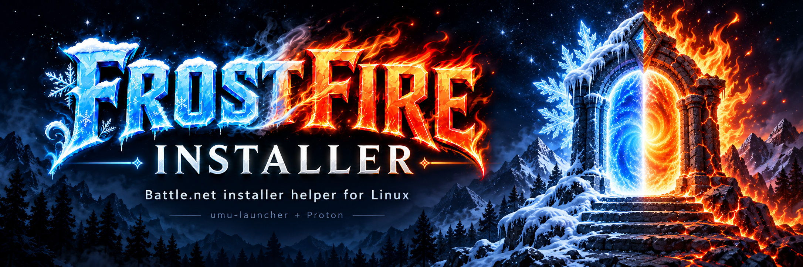
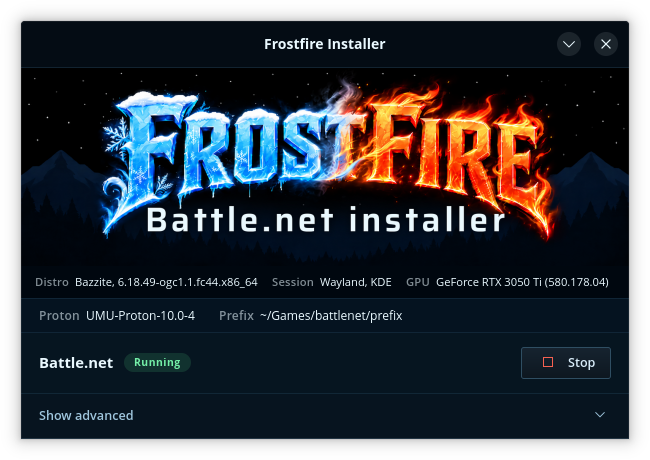
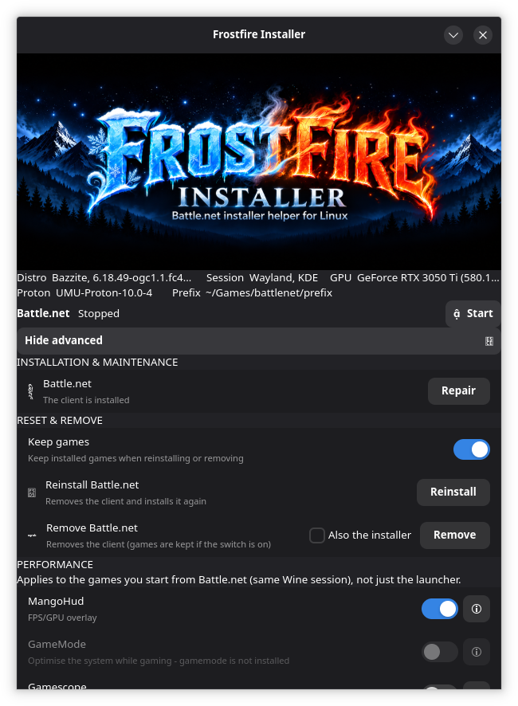

<p align="center">
  
</p>

# Frostfire Installer

> A **Battle.net installer helper** for Linux — stable and compatible, with a
> cool GUI. Backend: **umu-launcher + Proton**.

[](https://github.com/epatnor/frostfireinstaller/actions/workflows/ci.yml)
[](LICENSE)
[](pyproject.toml)

**Status:** early, but used daily on the reference machine. Scope and support:
[`docs/support.md`](docs/support.md).

## Focus

Not a game launcher or library — games start from Blizzard's own Battle.net
launcher. `frostfireinstaller` is the helper underneath:

- **Install, verify and repair Battle.net** (dedicated prefix, idempotent).
- **Compatibility:** the right Proton runner and the required environment fixes.
- **Performance:** optional MangoHud, GameMode and Gamescope wrappers that follow
  the games (same Wine session).
- **Broad distro support** (Bazzite/Fedora atomic, Arch, Debian/Ubuntu, ...).
- **A cool GUI:** GTK4/libadwaita with a frost/fire palette; a compact fixed-width
  launcher plus a resizable **Settings** window.

## GUI

```bash
frostfireinstaller gui
```

Banner → info strip (distro, session, GPU) → config band (Proton, prefix) →
Battle.net band (status + *Install*/*Start*/*Stop*) → *Settings*. A warning strip
appears only when the system check finds a problem, with copy-ready commands.
A tray icon (StatusNotifierItem) and a taskbar badge show when Battle.net runs.

| Main window | Settings |
|---|---|
|  |  |

## Requirements

- Linux, Python **3.11+**
- [`umu-launcher`](https://github.com/Open-Wine-Components/umu-launcher) (`umu-run`)
- A Proton build (GE-Proton, UMU-Proton, Proton-CachyOS) — or let umu download
  UMU-Proton on first launch
- Vulkan 1.3+ drivers and a 32-bit Vulkan loader (Battle.net is 32-bit)
- GUI only: `python3-gobject` (GTK4 + libadwaita)

## Install

| Channel | Command |
|---|---|
| pipx (any distro) | `pipx install --system-site-packages frostfireinstaller` |
| curl \| bash | `curl -fsSL .../packaging/install.sh \| bash` |
| AUR | `yay -S frostfireinstaller` |
| Bazzite / ublue | `ujust install-frostfireinstaller` |
| Homebrew | `brew install epatnor/frostfireinstaller/frostfireinstaller` |

Only the repo and GitHub release are public so far; the other channels work once
published. Until then: `git clone` the repo and `pipx install --system-site-packages .`.
Details, Flatpak and distro matrix: [`docs/install.md`](docs/install.md).

## Usage

```bash
frostfireinstaller              # ensure + launch Battle.net
frostfireinstaller gui          # graphical interface
frostfireinstaller ensure       # set up/verify only
frostfireinstaller doctor       # environment, status and system check
frostfireinstaller reinstall    # reinstall the client (keeps games)
frostfireinstaller remove [--purge-installer]   # remove the client (keeps games)
frostfireinstaller logs | install-logs          # latest run / installation log
frostfireinstaller kill         # stop all Battle.net processes
frostfireinstaller uninstall    # remove prefix, shortcut, icon
```

## Supported games

Everything Battle.net runs under Wine/Proton. Only titles whose anti-cheat refuses
Linux at kernel level cannot work (Call of Duty / Ricochet) — a vendor limitation.
WoW (retail, Classic, Forever), Diablo, Hearthstone, StarCraft, Heroes, Warcraft III
and Overwatch 2 are fine.

## Documentation

| Document | Contents |
|---|---|
| [`docs/install.md`](docs/install.md) | channels, distro matrix, prefix override, update/remove, Flatpak |
| [`docs/architecture.md`](docs/architecture.md) | backend, lifecycle, GUI and design, security, paths |
| [`docs/troubleshooting.md`](docs/troubleshooting.md) | common failures and fixes |
| [`docs/technical-reference.md`](docs/technical-reference.md) | Wine/Proton/umu and Battle.net background |
| [`docs/support.md`](docs/support.md) | scope, safety, no warranty |
| [`docs/ai-disclosure.md`](docs/ai-disclosure.md) | how the project is built with AI |

## Development

```bash
python -m venv .venv && . .venv/bin/activate
pip install -e ".[dev]"
ruff check . && ruff format --check . && mypy && pytest
```

Developer tools in `tools/` (never bundled): `make_icon.py`, `make_header.py`,
`make_symbols.py`. See [`CONTRIBUTING.md`](CONTRIBUTING.md).

## AI disclosure

Built with **generative AI under human supervision**; the maintainer designs,
reviews, tests and is responsible for the result. See
[`docs/ai-disclosure.md`](docs/ai-disclosure.md).

## License

MIT — see [LICENSE](LICENSE).
